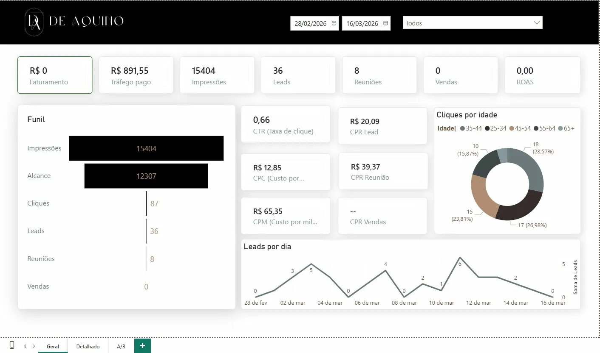
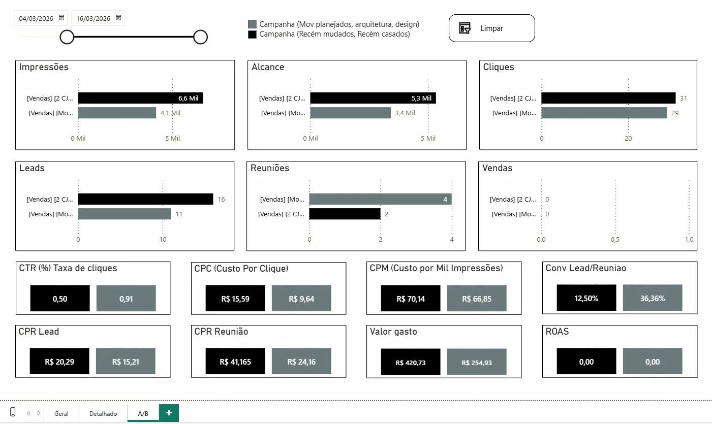

Dashboard de Performance — Tráfego Pago | Power BI

Sobre o projeto
Dashboard desenvolvido para monitoramento de campanhas de mídia paga (Meta Ads) de um cliente do segmento de arquitetura e design de interiores. O objetivo foi centralizar as principais métricas de performance em um único painel, facilitando a tomada de decisão sobre budget e estratégia de campanhas.

Problema
O cliente não tinha visibilidade clara sobre o desempenho das campanhas em tempo real, dificultando decisões sobre alocação de verba e identificação de públicos mais responsivos.

Solução
Criação de um dashboard interativo em Power BI com três abas: visão geral, detalhamento por campanha e comparativo A/B.

Métricas monitoradas
Funil completo de conversão: impressões, alcance, cliques, leads, reuniões e vendas. Indicadores de eficiência: CTR, CPC, CPM, ROAS, CPR Lead e CPR Reunião. Segmentação por faixa etária e comparativo entre campanhas.

Ferramentas utilizadas
Power BI, Excel, Meta Ads.

Resultado
Permitiu identificar que a campanha voltada para públicos recém casados e recém mudados gerava leads com custo menor e maior taxa de conversão para reunião, orientando a realocação de budget.
